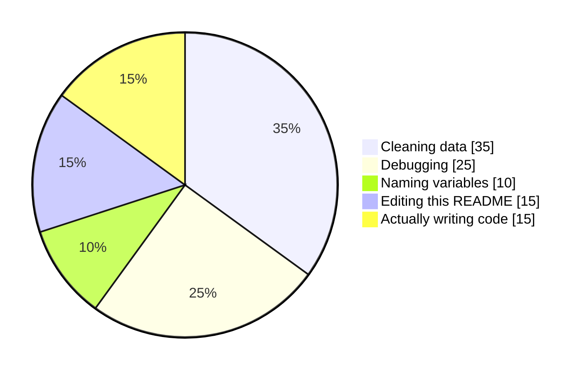

<div align="center">


<br/>

[](https://www.apalalamichhane.com.np)
[](https://www.linkedin.com/in/apala-lamichhane-aba780324/)
[](mailto:apala13579@gmail.com)
[](https://www.instagram.com/apala.exe/)

</div>

---

## 🌸 Hi, I'm Apala

I clean data, question it, find the story in it… and then build the dashboard, pipeline or app that puts the answer to work.
Also a professional bug creator and occasional bug fixer. Sometimes I pretend the bug was *"intentional architecture."*


- 🎓 **Fresh BSc CSIT graduate** from Softwarica College (Coventry University), June 2026
- 📊 **DataCamp certified Data Analyst**, looking for data roles in analysis, data engineering and ML
- 🥇 Won **1st place at DataForGood Nepal 2026** with my team
- 🤖 Thesis: a robot that **speaks Nepali**, powered by RAG, Llama 3.1, Whisper and ROS2
- 🍵 Powered by tea, snacks and questionable optimism
- 🌍 Based in Kathmandu, mentally sometimes inside a git commit message
- 🗣️ English, Nepali, Hindi and basic Mandarin (and fluent Stack Overflow)

<br clear="right"/>

---

## 🐍 `apala.py`

```python
class Apala:
    role       = "Data Analyst & Full Stack Developer"
    based_in   = "Kathmandu, Nepal 🇳🇵"
    education  = "BSc CSIT, Softwarica College (Coventry University), 2023 to 2026"
    certified  = ["DataCamp Data Analyst", "DataCamp Associate Data Analyst"]
    open_to    = ["data analyst", "data engineer", "ML", "full stack"]
    fuel       = ["tea", "snacks", "deadline panic"]

    def workflow(self, question):
        data = self.clean(self.collect(question))   # 70% of the job, honestly
        insight = self.explore(data)                 # where the fun lives
        return self.ship(self.explain(insight))      # dashboard, API or app

    def debug(self):
        while bug.exists():
            stare_at_screen()
            add_print_statement()
        return "it was the cache all along"
```

---

## 🧪 A very scientific hypothesis test

> **H₀:** The bug is in my code.<br/>
> **H₁:** It's the cache / the network / Mercury in retrograde.
>
> **p = 0.0001** → reject H₀ ✅<br/>
> *(Peer review: "it was a missing semicolon." Results withdrawn.)*

---

## 🗺️ Pick a path

| | World | What lives there | Try these |
|:-:|---|---|---|
| 📊 | **Data analysis** | cleaning, EDA, forecasting, dashboards | [Internet Freedom Dashboard](https://github.com/apala-1/Internet-Censorship-and-Freedom) · [Music streaming (IOA top 5)](https://github.com/apala-1/DataWaveMusicDataset) |
| 🤖 | **AI and ML** | RAG, local LLMs, speech, NLP | [Nepali-speaking robot](https://github.com/apala-1/llm_robot_bridge) · [Talking avatar](https://github.com/apala-1/talking-avatar) · [AuthentiText AI](https://github.com/apala-1/authenti-text-ai) |
| 🌐 | **Web platforms** | APIs, auth, real-time, security | [HuntrNepal](https://github.com/apala-1/huntrnepal) · [Not A Writing App](https://github.com/apala-1/not_a_writing_app_website) · [iCantEven](https://github.com/apala-1/icanteven) |
| 📱 | **Mobile and hackathons** | shipped under pressure | [Sahachari 🥇](https://github.com/apala-1/softwarica-hackathon-2026) · [SmartSahuji](https://github.com/apala-1/SmartSahuji) · [NearShare](https://github.com/apala-1/NearShare) |

---

## 🛠️ Tech stack (aka my emotional support tools)

**📊 Data & ML**<br/>


**🤖 AI**<br/>


**🌐 Web & Backend**<br/>


**📱 Mobile & Tools**<br/>


---

## 🏆 Trophy shelf

| | Achievement | |
|:-:|---|---|
| 🥇 | **1st place, DataForGood Nepal 2026** (Analytics for Society, team of 4) | NPR 1,00,000 |
| 🏅 | **Top 5, Student Sprint Analysis Challenge 2025** (Institute of Analytics) | $60 |
| 📜 | **DataCamp Data Analyst** certification | Sep 2026 |
| 📜 | **DataCamp Associate Data Analyst** certification | Mar 2026 |
| 🎓 | **BSc CSIT**, Softwarica College (Coventry University) | Jun 2026 |

---

## 🥧 How I *actually* spend my coding time



---

## 📈 Activity

<div align="center">

<picture>
  <source media="(prefers-color-scheme: dark)" srcset="https://raw.githubusercontent.com/apala-1/apala-1/output/github-snake-dark.svg" />
  
</picture>


</div>

---

## 🧩 Fun facts (read: unnecessary but important)

- I refactor my README more than my actual production code (exhibit A: you're reading it)
- "Quick fix" is my favourite lie
- I believe bugs disappear if you stare at them long enough
- I name variables like I name files: badly but confidently
- My portfolio has a tiny pixel creature called **ApBit** who climbs the scrollbar. Go boop him.

<details>
<summary>👾 click to meet ApBit</summary>

```
        ●
        │
     ▄██████▄
    ██ ◕  ◕ ██      < hi! i'm ApBit.
   ▐█   ‿‿   █▌       i live on apala's portfolio,
    ██▄▄▄▄▄▄██        climb scrollbars and nap on charts.
     ▀▀    ▀▀         please boop responsibly.
```

</details>

---

<div align="center">

✨ *everything compiles in theory. production is a social construct.* ✨


</div>
